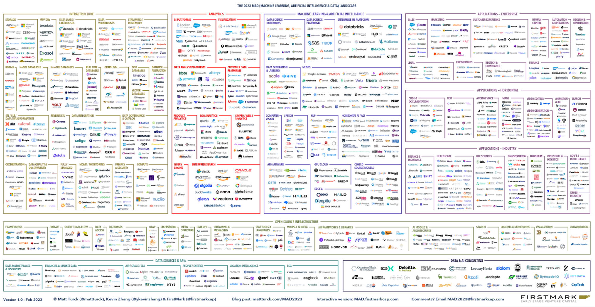
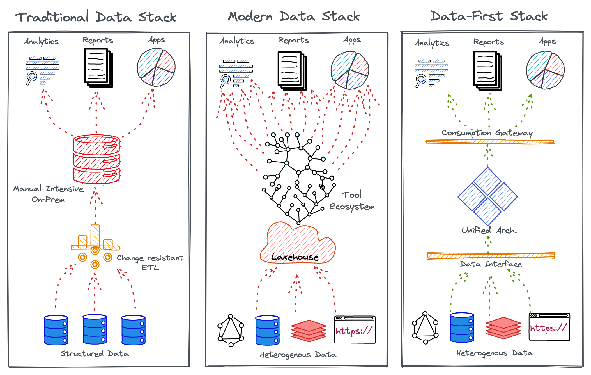
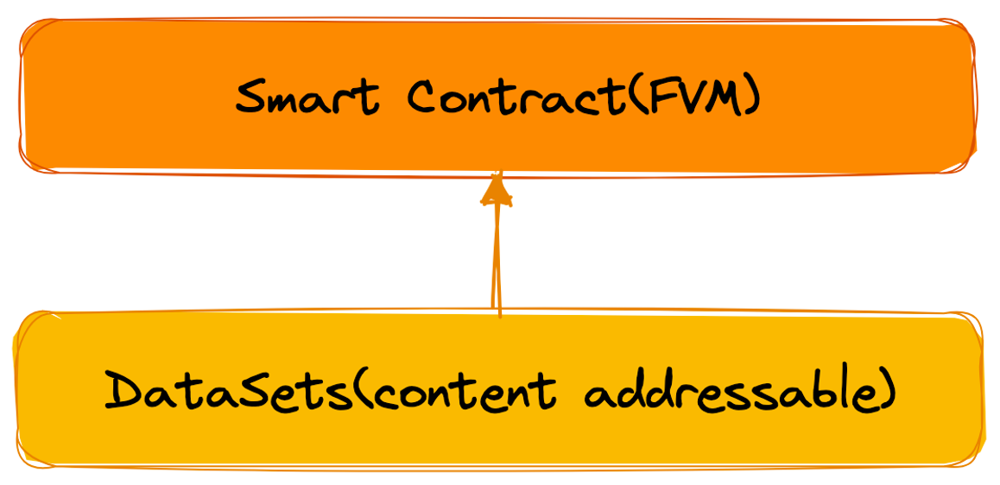
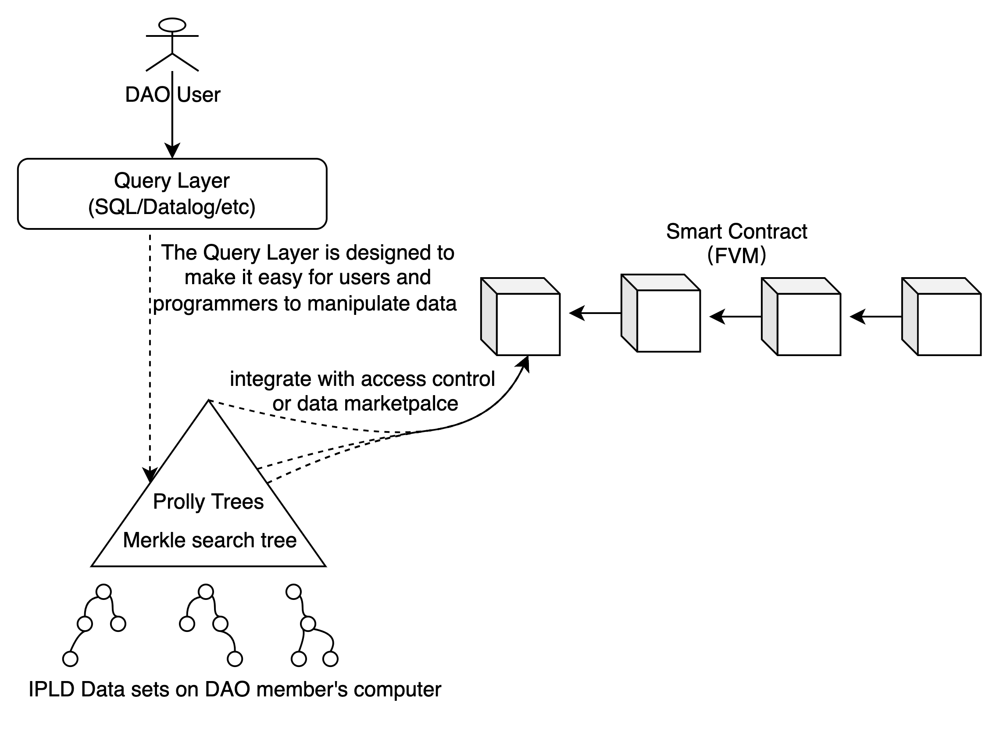
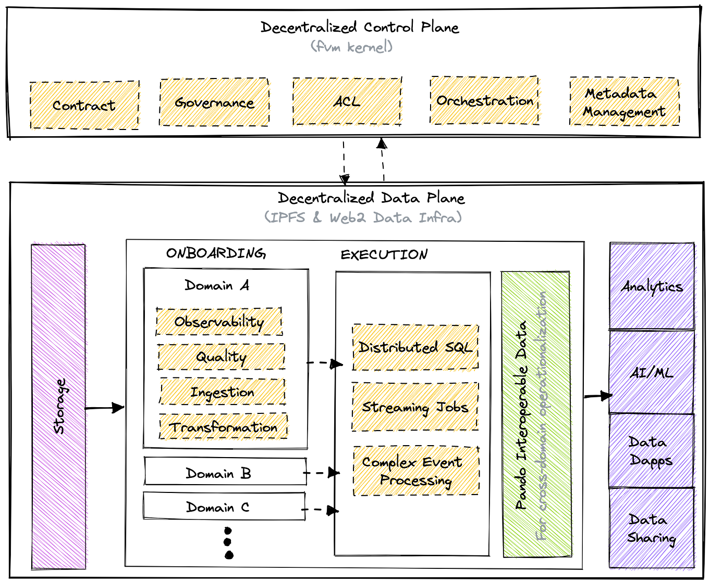

# IPOS
IPOS is an InterPlanetary Operating System for DataDAOs.

# Why an Operating System for Data?

At the point when we founded DataDAO Stack at the beginning of FVM Launch, we had two main insights about Data DAOs. The first was that Data Decentralized Autonomous Organizations (Data DAOs,We could also call it an open data economy) are the most important use case of the blockchain after currency, and the second was that it is impossible to predict what these Data DAOs will look like, and that there will be a fast evolution of them. As a consequence we decided to build IPOS, which is a generic platform for Data DAOs on the Filecoin network.

## What is an Operating System?
An Operating System is a program that, on installation, manages all programs that are necessary for the end user to experience the service of outcome-driven programs instead of figuring out ‘how’ to run those programs.

Most of us have experienced Operating Systems on our laptops, phones, and, in fact, on any interface-driven device or program. Some popular examples would be Windows, iOS, Android, and Linux.

Users are hooked to these systems because they are abstracted from the pains of booting, maintaining, and running the low-level nuances of day-to-day applications such as web browsers, spreadsheets, documentation apps, and even gaming programs.

> An Operating System abstracts users from the procedural complexities of applications and declaratively serves the outcomes.

## The need for a Data Operating System

This philosophy led to the milestone innovation of the first operating system for data, and needfully so. The requirement for an Operating System design is felt largely due to the overwhelming build-up of cruft within the bounds of data engineering.

Chaos has ensued for non-expert end users as data ecosystems progressively develop into complex and siloed systems with a continuous stream of point solutions added to the insane mix every other day. No surprise it has been called the MAD (ML, AI, & Data) landscape.

## Traditional Data Stack → Modern Data Stack → Data-First Operating System

Multiple stacks were devised to manage enterprise data over the decades. The most prominent ones were the traditional data stack (TDS) and the Modern Data Stack (MDS).

TDS came up as an ad-hoc solution to solve what was at hand on a need basis with on-premise big data ecosystems and SQL warehouses. MDS came up as a disconnected basket of solutions that targeted patches of the problem with fragile data pipelines and dumped all data to a central lake that eventually created unmanageable data swamps across industries.

Finally, the Data-First Stack (DFS) or the Data Operating System came up with a unification approach or an umbrella solution that targeted the weak fragments of TDS and MDS as a whole instead of proponing their patchwork philosophy.

DFS, or the Data Operating System, brings together a curated set of self-service layers that eliminate redundant tools and processes to enable a reusable, modular, and composable operating platform, elevating user productivity. Now, instead of grinding to integrate hundreds of scattered solutions, users can focus on the core objectives: Data and Data Applications.

The Data Operating System targets existing challenges of TDS and MDS to enable a Data-First stack for both data-savvy and data-naive organizations.

The targeted challenges of the prevalent stacks can be clubbed under the following umbrellas.

* **Overheads of Point Solutions** 

The Modern Data Stack (MDS) is littered with point solutions that come with integration, resource, and maintenance overheads, adding up to millions in investments. The MDS is known to unabatedly break Agile and DataOps principles. Instead of solving, MDS creates siloed data, blotchy insights, and security risks.

* **Adversities of Data Personas**

Data personas could be categorized under three principal brackets: Data Consumers who suffer from unreliable data quality, Data Producers who suffer from duplicated efforts to produce data for ambiguous objectives, and finally, Data Engineers who suffer from flooding requests from both data production and consumption sides.

* **Governance & Data Quality as an Afterthought**
  
Data governance has been a hot topic for quite some time, but successful implementations are still a myth. It’s a constant struggle to adhere to the organization’s data compliance standards. Lacking governance directly impacts the quality and experience of data that passes through serpentine pipelines blotched with miscellaneous and ad-hoc integration points.

* **Inferior Developer Experience**

The prevalent data stacks have a dearth of exemplary developer experience which robs data developers of the ability to declaratively manage resources, environments, and incoming requests to focus 100% on data solutions. Due to these diversions and the lack of a unified platform, it is nearly impossible for Data Engineers to build high-excellence pipelines or recover from mishaps on priority.

# What is a Web3 Data Operating System?

** The Web3 Data Operating System is a Unified Architecture Design that enables the Data-First Stack to abstract complex and distributed subsystems for a consistent outcome-first experience for non-expert end users. **

The Web3 Data Operating System is synonymous with a Programmable Data Platform that takes care of low-level resource management tasks to allow data developers the complete freedom to declaratively manage less strategic operations.

The Unified Platform Approach enables control over a narrow set of endpoints instead of managing countless integrations. It ruthlessly chops down redundant tools to eliminate integration, maintenance, expertise, and cost overheads that otherwise would build up to millions with no tangible outcome. Ultimately, the Data Operating System shrinks the journey from unreliable data to trustworthy business insights.

## Mindset Transformation precedes Architecture Transformation.

Many data-first organizations, the likes of Uber, Airbnb, and Google, understood the significance of a data-first approach long back and dedicated major projects and years to becoming data-first. Replicating them is not the solution since their data stacks were catered to their specific internal architectures.

> A data-first stack is only truly data-first if it is built in accordance with the organization’s internal infrastructure.

Contrary to the widespread mindset that it takes years to build a data-first stack as it used to, with the milestone innovation of the Data Operating System, this assertion is no longer valid. It is not impossible to build a data-first stack and reap observable value within weeks instead of months and years.

## Back to Basics (Primitives)

Becoming data-first within weeks is possible through the high internal quality of composable Data Operating System architectures: Unification through Modularization.

The Data Operating System, technically defined, is a set of primitives that talk to each other to declaratively enable any and every operation that data users, generators, or operators require. Like a common set of core building blocks or lego pieces that can be put together to construct anything, be it a house, a car, or any object.

A Data Operating System’s core primitives can similarly be put together to construct or deconstruct any data application that helps data developers serve and improve actual business value instead of wasting their time and efforts on managing the complex processes behind those outcomes.

# Primitives of a Web3 Data Operating System

Primitives are atomic and logical units with their own life cycle, which can be composed together and also with other components and stacks to act as the building block of the Data Operating System. They can be treated as artifacts that could be source-controlled and managed using a version control system. Every Primitive can be thought of as an abstraction that allows you to enumerate specific goals and outcomes in a declarative manner instead of the arduous process of defining ‘how to reach those outcomes’.

## Contract

Contracts are expectations on data in the form of shape, business meaning, data quality, or security. They are guidelines or agreements between data producers and consumers to declaratively ensure the fulfillment of expectations. Contracts can be enabled by any primitive in the Data Operating System.

## Governance

As a result of both the necessity for governing the growing landscape of decentralized technologies and networks and the ideals of its community, a class of tools and concepts for decentralized governance has emerged.  The concept of a Distributed Autonomous Organization (DAO) enables individuals and entities to form groups, jointly own assets, make decisions, and participate in the economics of the DAO.  Several mature building blocks for DAOs have emerged, including Aragon and DAOStack.  They include and extend to tools like voting structures, and multi-signature wallets for joint custody of assets.  On the level of protocols, mechanisms for staking and slashing have emerged to incentivise participants in these open networks to behave benevolently.  

The IPOS System can benefit from insights and tools from decentralized governance both for governing IPOS platforms and their components, and enabling economic participation in each, as well as for people to organize themselves within it, such as with gamer guilds or clans.

DAO Stack reference:
> 
> Arc is the base layer of the DAO stack. It consists of a set of smart contracts deployed on the Ethereum blockchain that define the basic building blocks and standard components that can be used to implement any DAO.
> 
> Arc is a modular, upgradeable platform that allows for a rapid natural selection of governance systems.
> 
> 
> 
> Every box in this Figure represents a smart contract. 
> 
> The Token contract probably does not require an explanation, being the most popular use-case of the Ethereum network.
> 
> The Avatar contract is the face of an organization on the blockchain, e.g. if the organization is to hold ownership of anything, like ownership over a contract or asset, the owner address will be the Avatar.
> 
> The Reputation contract stores a DAO's reputation data. In Arc, Reputation represents a user's decision power in a given DAO. It is very similar to a token, with two main differences: one, it is non-transferable, and two, it can be granted or taken away by the DAO.
>
> On the right side of the figure we have the schemes. Schemes are simple pieces of logic describing the different actions a DAO can take. One example is a scheme for funding proposals, in which everyone can suggest and vote on proposals, and if a proposal is approved, it is automatically funded.
> 
> At the bottom are the global constraints. Global constraints prevent current and future modules from breaking certain overarching rules, e.g. a cap on an organization’s total possible reputation.
> 
> The Controller is an access control module that keeps a record of all the registered schemes in a DAO and the permissions for each scheme. It also records all global constraints and enforces them by reverting transactions that violate them.

Aragon Stack reference:

> From a technical perspective, Aragon can be seen as an operating system for human organizations. Therefore, the Aragon stack can be thought of as an operating system, just like macOS or Linux.
> 
> A computer operating system manages which processes have access to the computer's resources. They do that with the following components:
> 
> * A Kernel, which has drivers that let the software control the hardware
> * A permission system, to manage which processes can access each resource
> * A self-upgrade system, for bugs and enhancements
> 
> 
> 
> You wouldn't want a Tetris app to own full control over your computer's RAM. That would enable tampering with other apps or stealing precious information. Similarly, you wouldn't want a CryptoKitties app to have full control over the funds of your DAO.
> 
> The role of the OS, and in this case of the Aragon stack, is to create an environment in which apps can abstract over the underlying resources while ensuring security.
> 
## Model

Models are semantic data model constructs devised by business teams to power specific use cases. Models enable the injection of rich business context into the data model and act as an ontological/taxonomical layer above contracts and physical data to expose a common business glossary to the end consumer.

## Workflow

Workflow is a manifestation of a Directed Acyclic Graph, which helps you to streamline and automate the process of working with big data. Any data ingestion or processing task in the Data Operating System, irrespective of whether it’s batch or streaming data, are defined and executed through Workflows.

## Service

A Service is a long-running process that is receiving and/or serving an API. It’s for scenarios that need a continuous flow of real-time data, such as handling event processing, real-time stock trades, etc. Service makes it easy to gather, process, and scrutinize streaming data so you can react quickly.

## Policy

Policies govern the behavior of persons, applications, & services. Two kinds of policies prevail in a Data Operating System. Access policy is a security measure regulating individuals. Data policies describe the rules controlling the integrity, security, quality, and use of data during its lifecycle and state change.

## Depot

Depot provide you with a uniform way to connect with a variety of data sources. Depot abstract away the different protocols and complexities of the source systems to present a common taxonomy and route to address these source systems.

## Pando - Data (& Process) Lineage & Provenance

* Data Lineage - reporting of data lifecyle from source to destination
* Data Provenance - a means of proving data lineage using historical records that provide the means of pipeline re-execution and data validation

## Indexing
Right now IPFS is great for storing raw binary data, FIL is great for keeping data stored, and FVM smart contracts will bring a way to author and interact with the data. One thing that is missing is the story for how one could work with large amounts of structured data.

The Prolly Tree spec can be used to generate large indexes of structured data which can enable code to work entirely within FVM without needing external indexing services. Any data ingested into Prolly Trees could be stored directly on chain and can be efficiently queried by a smart contract without needing to fully download a dataset.

## Cluster

A cluster is a collection of computation resources and configurations on which you run data engineering, data science, and analytics workloads. A Cluster in a Data Operating System is provisioned for exploratory, querying, and ad-hoc analytics workloads.

## Secret

Secrets allow you to store sensitive information such as passwords, tokens, or keys. Users can gain access by using the name of the ‘Secret’ instead of using the sensitive information directly. The decoupling from other primitives allows for monitoring and control access while minimizing the risk of data leaks.

## Database

Database primitive is for the use cases where output is to be saved in a specific format in a relational database. This primitive can be used in all the scenarios where you need to syndicate structured data. Once you create a Database, you can put a depot & service on top of it to serve the data instantly.

## Compute

Compute resources can be thought of as the processing power required by any data processing workflow/service or query workload to carry out tasks. Compute is related to common server components, such as CPUs and RAM. So a physical server within a cluster would be considered a compute resource, as it may have multiple CPUs and gigabytes of RAM for processing workloads.

## Storage

The idea that storage could also be decentralised by specialised protocols like Filecoin and IPFS, so not reliant on or giving any advantage to any one company for example Amazon, Google, or Microsoft, which control 66% of the market. 

It almost means people that invest in expensive hardware to access the IPOS and increase performance can offset some of the cost by renting out capacity and in turn earning crypto-currencies and joining the virtual economy.   It is also believed at a certain scale, and density in a given physical locale, it could increase the proximity of physical hardware to The Cloud at any given time as we unlock the bandwidth and compute of neighbouring connections, and therefore allow greater ‘edge computing’ for IPOS ubiquity.

# Defining principles of a Data Operating System

## Data as a Product

The most important objective of a Data Operating System is to consistently deliver Data Products. A Data Product is a unit of data that adds value to the end user. A Data Product must be Discoverable, Addressable, Understandable, Natively accessible, Trustworthy, Interoperable-and-composable, Valuable on its own, and Secure. A Data Product is materialized after raw ingested data is passed through the three-tiered Data Operating System architecture.

## Artefact first, GUI second

The Data Operating System Architecture is made for Data Developers. With a suite of loosely coupled and tightly integrable primitives, it enables complete data engineering flexibility in terms of how the OS is operationalized. Being Artefact-first with open standards, it can be used as an architectural layer on top of any existing data infrastructure. GUIs are deployed for business users to directly consume potent data.

## Developer Experience

The Data Operating System is a programmable data platform that enables state-of-the-art developer experience for data developers. It’s a complete self-service interface for developers where they can declaratively manage resources through APIs, CLIs, and even GUIs if it strikes their fancy. The curated self-service layers made of OS primitives enable a dedicated platform to increase user productivity.

## Contractual Handshakes

Contracts in data development are analogous to APIs in software development. A Data Operating System’s primitives directly implement Open Data Contracts, which are expectations on data. It is an agreement between producers and consumers to declaratively ensure the fulfillment of the data shape, quality, & security expectations.

## Outcome First

A Data Operating System mercilessly trims down unnecessary sidecars to ensure the results are put first. Every primitive is directly tied to the business purpose through a semantic layer. This establishes a direct positive correlation to revenue since data is selectively managed only for use cases with direct business applications.

## Zero trust security

A Data Operating System is suspicious of every event within its ecosystem. It does not accept implicit trust and goes several steps beyond by continuously validating security policies at every exchange point through purpose-driven ABAC policies. Security engines are segregated into central and distributed pockets.

## Data-First Stack
The Data-First stack goes exactly by its name and puts data first by abstracting all the nuances of low-level data management, which otherwise suck out most of the data developer’s active hours. A Data Operating System’s data applications consequently optimize resources and ROI.

# Conceptual Architecture of a Data Operating System

## The Three-Tier Logical Infrastructure

A Data Operating System is conceptually segregated into three logical layers that talk to each other and establish a complete 360-degree data view while ensuring the physical data and logical constructs are safely decoupled. Changes or updates in either layer can selectively be obstructed from corrupting each other. The first layer consumes and maintains physical data, the second layer creates knowledge by detecting active and valuable interrelations within data and metadata, and the third layer empowers a direct tie with business purposes to create insights and wisdom.

* **Data Layer**

The data layer establishes a connection with heterogenous, multi-cloud environments to make data addressable consistently. This layer provides users access to data via a standard SQL interface, automatically catalogs the metadata, and implements data privacy using purpose-driven ABAC. This layer is key to establishing declarative integration without worrying about maintenance or process overheads.

* **Knowledge Layer**

The knowledge layer’s graph-like structure is analogous to a biological neural network. With metadata management capabilities, this layer identifies associations between data assets and surfaces up lineage, provenance, and key relations. It enables the discovery of latent information, and with open APIs, users can augment the data programmatically.

* **Semantic Layer** 
  
A semantic layer is capable of accessing and modeling data across heterogeneous sources. It allows you to view and express various business concepts through different lenses. With open data contracts in the mix, business users can express their data expectations and enforce them on data that channels through the semantic data models.

## The Decentralized Control Plane (Web3) & Distributed Data Plane(Web2)

A Data Operating System can also be broken down into two conceptual planes: The Control Plane and the Data Plane. Control & Data plane separation decouples the governance and execution of data applications. This gives the flexibility to run the operating system for data in a hybrid environment and deploy a multi-tenant data architecture. Organizations can manage cloud storage and compute instances with a decentralized control plane backed by FVM.

## Control Plane

The Control plane helps admins govern
1. Policy-based and purpose-driven access control of various touchpoints in cloud-native environments.
2. Orchestrate data workloads, compute cluster life-cycle management, and version control of a Data Operating System’s resources.
3. Metadata of different types of data assets.

## Data Plane

The Data plane helps data developers to deploy, manage and scale data products.

1. The distributed SQL query engine works with data federated across different source systems.
2. Declarative stack to ingest, process, and extensive syndicate data.
3. Complex event processing engine for stateful computations over data streams.
4. Declarative DevOps SDK to publish data apps in production.

# How does a Data Operating System Manifest?

# Data Flow in a Data Operating System: Data to Insights

# Decentralized machine learning

# Decentralized Federated Learning

# Reputation DAO aka. Trustless Reputation System

# Coming Up

Watch this space for more information on the art-of-possible with a Web3 Data Operating System
* How does a Web3 Data Operating System enable design architectures such as Data Mesh and Data Fabric?
* How does a Web3 Data Operating System enable direct business value through constructs such as Customer 360?
* Could a Web3 Data Operating System’s primitives be used selectively?
* How does a Web3 Data Operating System work with existing Data Infrastructures?
* How does a Web3 Data Operating System enable value for organizations that have already instilled multiple point solutions?
* Are there any existing implementations of a Web3 Data Operating System?
* Is a Web3 Data Operating System relevant for on-premise data ecosystems?